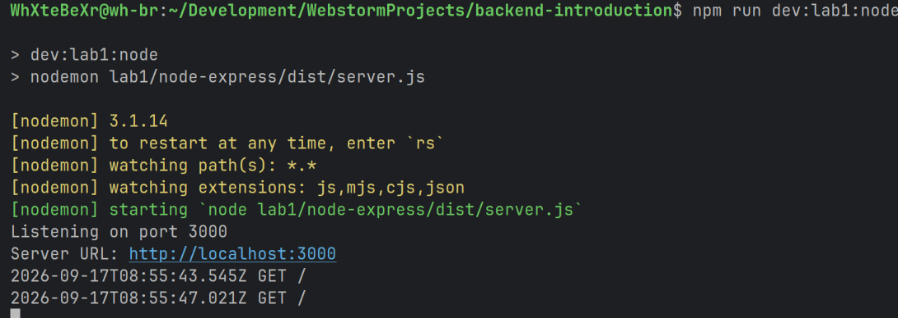

# Отчет по лабораторной работе 1

МИНИСТЕРСТВО НАУКИ И ВЫСШЕГО ОБРАЗОВАНИЯ
РОССИЙСКОЙ ФЕДЕРАЦИИ
Федеральное государственное автономное
образовательное учреждение высшего образования
«СЕВЕРО-КАВКАЗСКИЙ ФЕДЕРАЛЬНЫЙ УНИВЕРСИТЕТ»
Институт перспективной инженерии
Департамент цифровых, робототехнических систем и электроники
Межинститутская базовая кафедра

**Тема:** Настройка среды разработки и первый HTTP-сервер

**Выполнил:**
Студент группы ПИЖ-б-о-25-2 (2),
направление подготовки: 09.03.04
“Программная инженерия”
Кравцун Михаил Алексеевич

**Проверил:**
Заведующая МИБК
Новикова Елена Николаевна

---

## Задачи лабораторной работы

**Цель:** Освоить установку инструментов для бэкенд-разработки, создать и запустить минимальный веб-сервер,
обрабатывающий GET-запросы, понять концепцию эндпоинтов, научиться настраивать автоматический перезапуск сервера.

---

## Ход выполнения
### Теоретическое обоснование

Бэкенд - серверная часть приложения, отвечающая за обработку запросов, бизнес-логику и формирование ответов; работает по модели «клиент-сервер», где клиент отправляет HTTP-запрос, а сервер его обрабатывает и возвращает ответ.

Эндпоинт - это URL в сочетании с HTTP-методом, по которому клиент обращается к серверу за ресурсом; маршрут - механизм сопоставления пути запроса с обработчиком на сервере. Метод GET используется только для получения данных и не должен изменять состояние сервера (идемпотентен и безопасен).

JSON - стандартный текстовый формат обмена данными в REST API, представляющий данные как пары «ключ-значение».

Для бэкенд-разработки можно использовать Node.js + Express (JavaScript-фреймворк, упрощающий маршрутизацию, работу с middleware и формирование ответов) или Python + Flask (лёгкий фреймворк на Python). Для удобства разработки применяется автоматический перезапуск сервера при изменении кода: в Node.js - через пакет `nodemon`, во Flask - через режим `debug=True`.

### Реализация на Python + Flask

_Приветсвие на корневом пути_

_Демонстрация /api/time ендпоинта_

_Демонстрация /api/info ендпоинта_

_Демонстрация /api/users ендпоинта_

_Демонстрация /api/user/2 ендпоинта_

_Демонстрация /api/projects ендпоинта_

_Демонстрация 404 ошибки_

_Логирование выполненных запросов в консоль_

### Реализация на Node.js + Express

На Node.js + Express был реализован идентичный функционал серверной части, ендпоинты работают одинаково и отдают
одинаковые данные

_Запуск сервера на Node.js_

## Контрольные вопросы

**1. Что такое клиент-серверная архитектура?**

Это модель взаимодействия, в которой клиент (браузер, мобильное приложение) отправляет запрос, а сервер принимает его, обрабатывает и возвращает ответ. Клиент инициирует взаимодействие, сервер - реагирует.

**2. Какой протокол используется для общения клиента и сервера в вебе?**

HTTP (HyperText Transfer Protocol), а для защищённого соединения - его расширение HTTPS.

**3. Что такое эндпоинт (endpoint)?**

Эндпоинт - это конкретный адрес (URL) в сочетании с HTTP-методом, по которому клиент обращается к серверу за определённым ресурсом. Например, `GET /api/users`.

**4. Какую структуру имеет HTTP-запрос и HTTP-ответ? Что такое код состояния (status code)?**

HTTP-запрос состоит из: метода (GET, POST и т.д.), URL, заголовков (headers) и, опционально, тела запроса (body). HTTP-ответ включает код состояния, заголовки и тело ответа с данными.

Код состояния (status code) - трёхзначное число, показывающее результат обработки запроса сервером (например, 200 - успех, 404 - не найдено, 500 - ошибка сервера).

**5. Что такое JSON? Почему он популярен в веб-разработке?**

JSON (JavaScript Object Notation) - текстовый формат обмена данными, представляющий структуры в виде пар «ключ-значение» и массивов. Он популярен из-за простоты чтения человеком, лёгкости разбора программами практически на любом языке и компактности по сравнению с XML.

**6. Как запустить сервер на Node.js или Flask?**

Node.js + Express: `node app.js` (или `npm start`, если прописан скрипт в `package.json`).
Python + Flask: `python app.py`.

**7. Что такое автоматический перезапуск сервера и зачем он нужен? Какой пакет используется для Node.js?**

Автоматический перезапуск (hot reload) отслеживает изменения в файлах проекта и сам перезапускает сервер, избавляя разработчика от необходимости делать это вручную после каждой правки кода. Для Node.js используется пакет `nodemon`. Для Flask аналогичную роль выполняет режим `debug=True`, который включает автоперезагрузчик (reloader).

**8. Какие коды состояния HTTP вы знаете? За что отвечает код 404?**

Основные группы: 2xx - успех (200 OK, 201 Created, 204 No Content), 4xx - ошибка клиента (400 Bad Request, 404 Not Found), 5xx - ошибка сервера (500 Internal Server Error). Код 404 означает, что запрошенный ресурс или маршрут не найден на сервере.

**9. Что такое middleware в Express / декораторы запросов во Flask (для продвинутого уровня)?**

Middleware в Express - это функция, которая выполняется на промежуточном этапе между получением запроса и отправкой ответа: может логировать запросы, парсить тело, проверять авторизацию и т.д., передавая управление дальше через `next()`. Во Flask похожую функцию выполняют декораторы вроде `@app.before_request` - код, который выполняется перед обработкой каждого запроса.

**10. Как получить параметр из URL-пути (например, ID пользователя) в вашем фреймворке?**

В Express: параметр указывается в маршруте как `:id` (например, `/api/users/:id`) и считывается через `req.params.id`.
Во Flask: параметр указывается в маршруте с типом, например `<int:user_id>` (например, `/api/users/<int:user_id>`), и передаётся напрямую как аргумент функции-обработчика.

## Итоги проделанной работы

**Вывод:** Освоил установку инструментов для бэкенд-разработки, создал и запустил минимальный веб-сервер,
обрабатывающий GET-запросы, понял концепцию эндпоинтов, научился настраивать автоматический перезапуск сервера.