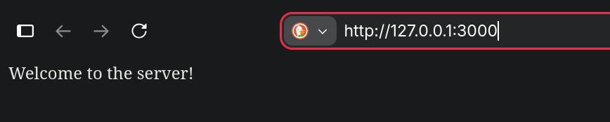
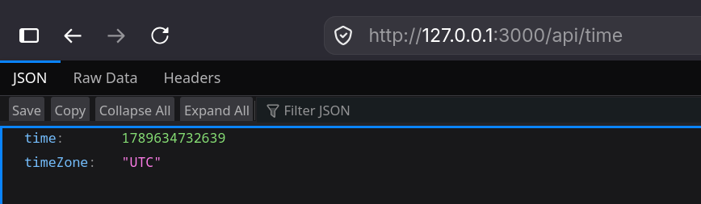
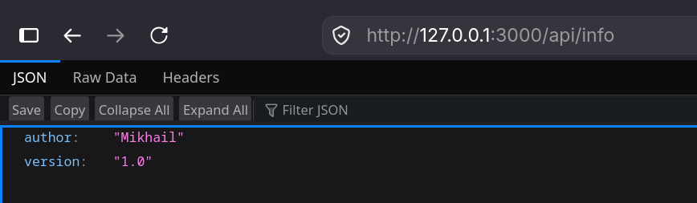
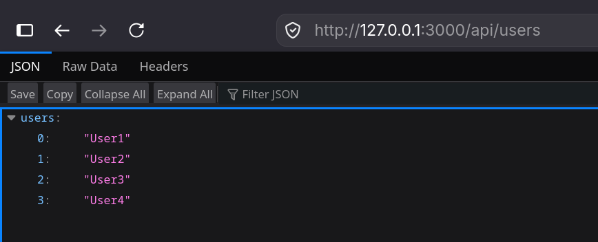
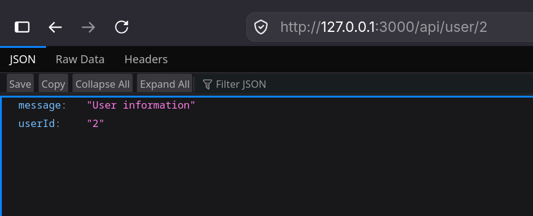
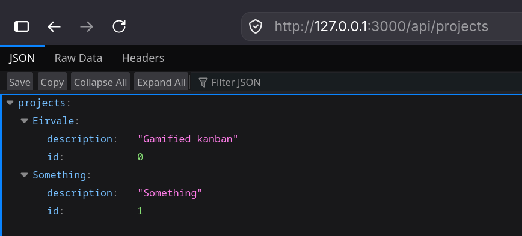
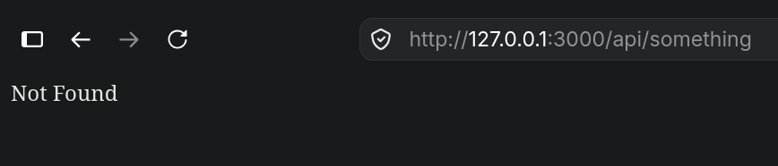
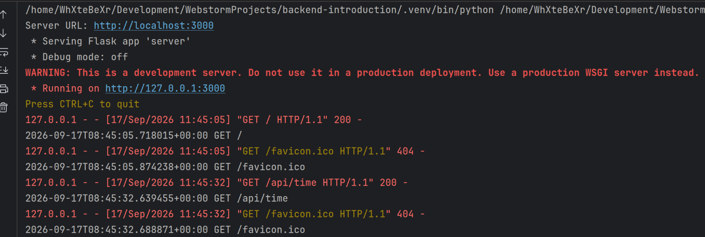

# Отчет по лабораторной работе 1

МИНИСТЕРСТВО НАУКИ И ВЫСШЕГО ОБРАЗОВАНИЯ
РОССИЙСКОЙ ФЕДЕРАЦИИ
Федеральное государственное автономное
образовательное учреждение высшего образования
«СЕВЕРО-КАВКАЗСКИЙ ФЕДЕРАЛЬНЫЙ УНИВЕРСИТЕТ»
Институт перспективной инженерии
Департамент цифровых, робототехнических систем и электроники
Межинститутская базовая кафедра

**Тема:** Настройка среды разработки и первый HTTP-сервер

**Выполнил:**
Студент группы ПИЖ-б-о-25-2 (2),
направление подготовки: 09.03.04
“Программная инженерия”
Кравцун Михаил Алексеевич

**Проверил:**
Заведующая МИБК
Новикова Елена Николаевна

---
## Задачи лабораторной работы

**Цель:** Освоить установку инструментов для бэкенд-разработки, создать и запустить минимальный веб-сервер,
обрабатывающий GET-запросы, понять концепцию эндпоинтов, научиться настраивать автоматический перезапуск сервера.

---
## Ход выполнения
### Реализация на Python + Flask

_Приветсвие на корневом пути_

_Демонстрация /api/time ендпоинта_

_Демонстрация /api/info ендпоинта_

_Демонстрация /api/users ендпоинта_

_Демонстрация /api/user/2 ендпоинта_

_Демонстрация /api/projects ендпоинта_

_Демонстрация 404 ошибки_

_Логирование выполненных запросов в консоль_

### Реализация на Node.js + Express
