# Отчет по лабораторной работе 2

МИНИСТЕРСТВО НАУКИ И ВЫСШЕГО ОБРАЗОВАНИЯ
РОССИЙСКОЙ ФЕДЕРАЦИИ
Федеральное государственное автономное
образовательное учреждение высшего образования
«СЕВЕРО-КАВКАЗСКИЙ ФЕДЕРАЛЬНЫЙ УНИВЕРСИТЕТ»
Институт перспективной инженерии
Департамент цифровых, робототехнических систем и электроники
Межинститутская базовая кафедра

**Тема:** Настройка среды разработки и первый HTTP-сервер

**Выполнил:**
Студент группы ПИЖ-б-о-25-2 (2),
направление подготовки: 09.03.04
“Программная инженерия”
Кравцун Михаил Алексеевич

**Проверил:**
Заведующая МИБК
Новикова Елена Николаевна

---
## Задачи лабораторной работы
**Цель работы:** Освоить обработку различных HTTP-методов (GET,
POST, PUT, DELETE) в Express/Flask. Научиться реализовывать CRUD-
операции над коллекцией объектов, хранящейся в памяти сервера, а также
возвращать корректные HTTP-коды ответов (200, 201, 404).

---
## Ход выполнения

### Теоретическое обоснование

CRUD - акроним четырёх базовых операций над данными: Create (создание, POST), Read (чтение, GET), Update (обновление, PUT/PATCH) и Delete (удаление, DELETE), которым соответствуют аналогичные операции SQL (INSERT, SELECT, UPDATE, DELETE).

GET используется для получения данных, идемпотентен и безопасен (не изменяет состояние сервера), не имеет тела запроса. POST создаёт новый ресурс, не идемпотентен - повторный запрос создаёт дубликат, тело запроса содержит данные нового ресурса. PUT полностью заменяет существующий ресурс, идемпотентен - повторный запрос даёт тот же результат. DELETE удаляет ресурс, идемпотентен - повторное удаление не меняет результат.

Основные коды состояния HTTP: 200 OK (успешный GET/PUT/DELETE), 201 Created (успешный POST), 204 No Content (успешный DELETE без тела ответа), 400 Bad Request (ошибка в данных запроса), 404 Not Found (ресурс не найден), 500 Internal Server Error (ошибка на сервере).

В рамках лабораторной данные хранятся в памяти сервера (массив/объект), без использования базы данных - это просто и быстро, но данные теряются при перезапуске сервера и такой подход не подходит для production.

---

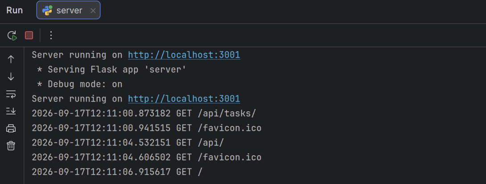
_Запуск сервера_

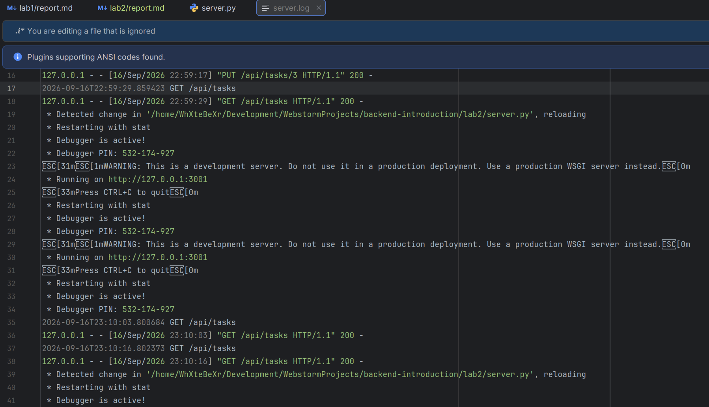
_Демонстрация логирования в файл_

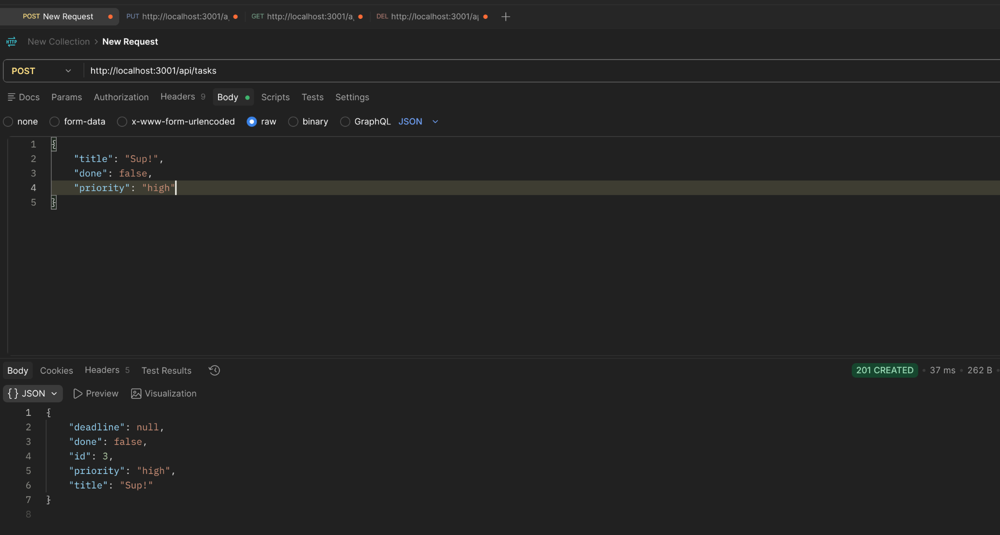
_Создание элемента Endpoint /api/tasks_

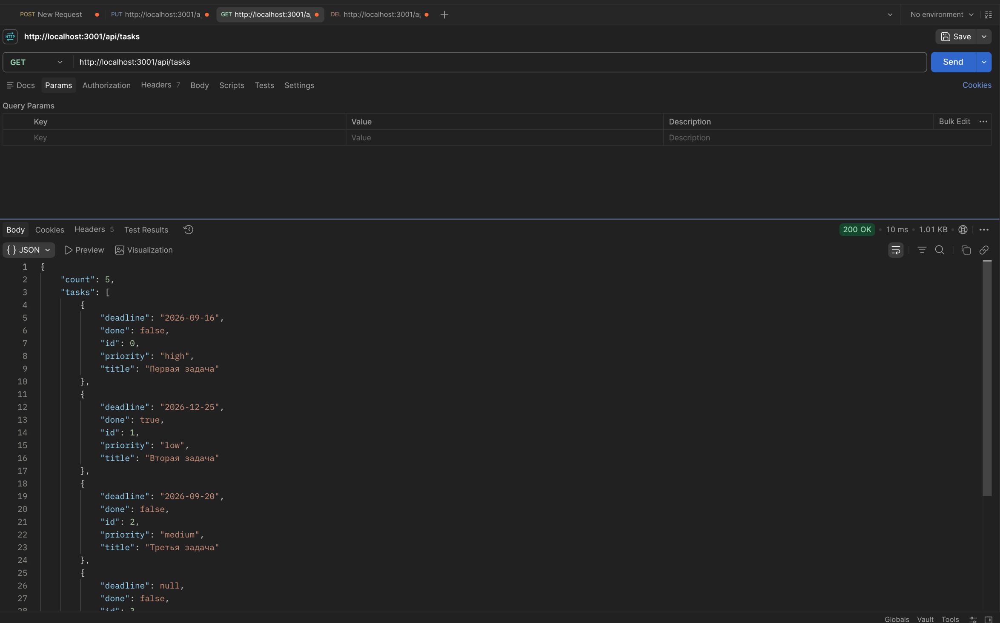
_Вывод всех задач Endpoint /api/tasks_

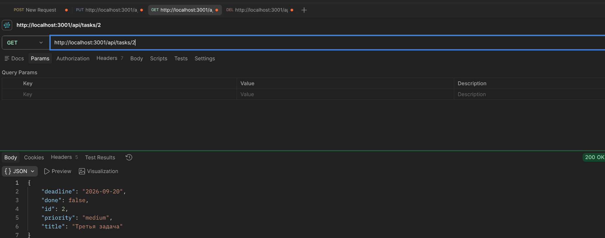
_Вывод задачи по id Endpoint /api/tasks/id_

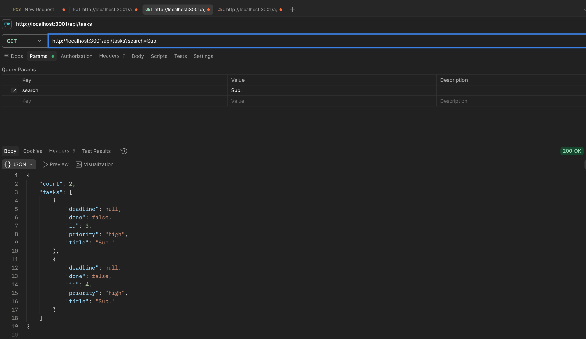
_Поиск по title Endpoint /api/tasks?search=Sup!_

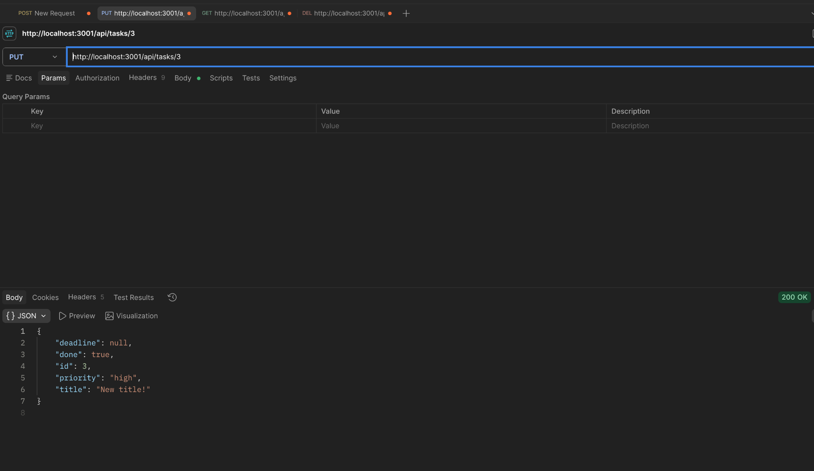
_Изменение элемента на сервере по id методом put Endpoint /api/tasks/id_

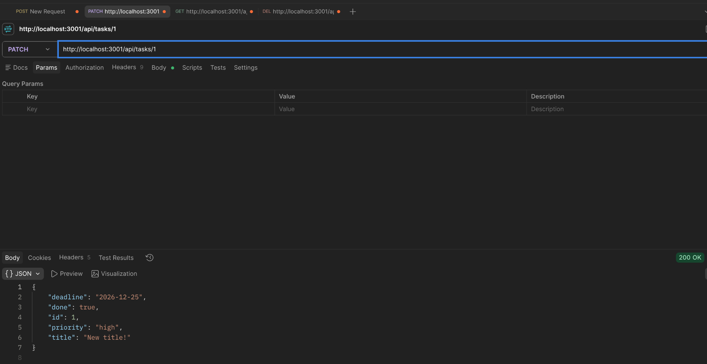
_Изменение элемента на сервере по id методом patch Endpoint /api/tasks/id

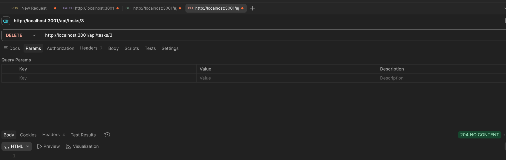
_Удаление элемента по id методом delete Endpoint /api/tasks/id_

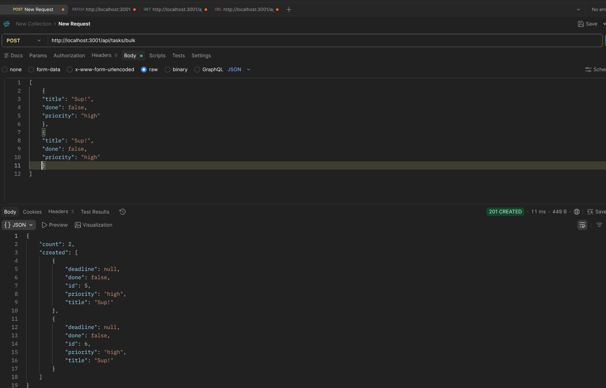
_Создание множества элементов Endpoint /api/tasks/bulk_

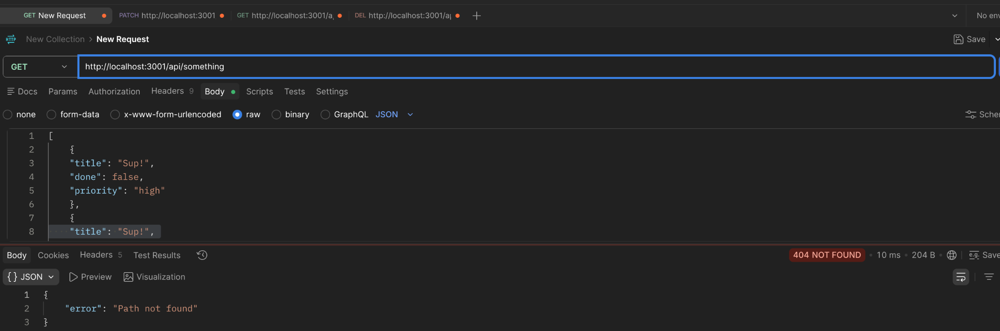
_Демонстрация 404 кода ошибки_

---
## Контрольные вопросы

### Базовый уровень

**1. Что такое CRUD? Расшифруйте каждую букву.**

CRUD - акроним от четырёх базовых операций над данными: Create (создание, POST), Read (чтение, GET), Update (обновление, PUT/PATCH), Delete (удаление, DELETE).

**2. Какие HTTP-методы соответствуют операциям CRUD?**

Create - POST, Read - GET, Update - PUT (полное обновление) или PATCH (частичное), Delete - DELETE.

**3. Что такое идемпотентность HTTP-методов? Какие методы идемпотентны?**

Идемпотентность - свойство метода, при котором повторное выполнение одного и того же запроса даёт тот же результат, что и однократное. Идемпотентны: GET, PUT, DELETE. POST - не идемпотентен, так как повторный запрос создаёт новый ресурс.

**4. Какой код ответа возвращается при успешном создании ресурса (POST)?**

201 Created.

**5. Какой код ответа возвращается при успешном удалении ресурса?**

200 OK (если в ответе есть тело, например удалённый объект) или 204 No Content (если тело ответа отсутствует).

**6. Что такое middleware в Express? Для чего используется express.json()?**

Middleware - функция, выполняющаяся между получением запроса и отправкой ответа, способная модифицировать запрос/ответ или прервать цепочку обработки. `express.json()` - встроенный middleware, который парсит тело запроса в формате JSON и помещает результат в `req.body`, без него `req.body` будет `undefined`.

**7. Как получить параметры из тела POST-запроса в Express?**

Через `req.body` (при условии, что подключён `express.json()` для парсинга JSON-тела).

**8. Как получить параметр из URL (например, ID)?**

Через `req.params`, например для маршрута `/items/:id` - `req.params.id`.

**9. Как найти элемент в массиве по ID?**

С помощью метода `Array.prototype.find()`, например: `items.find(item => item.id === id)`.

**10. Какой код ответа возвращается, если ресурс не найден?**

404 Not Found.

**11. Как отправить JSON-ответ в Express?**

Через метод `res.json(data)`.

**12. Как вернуть статус-код 201 в Express?**

Через `res.status(201).json(data)`.

**13. Что произойдёт с данными в памяти при перезапуске сервера?**

Все данные будут потеряны, так как они хранятся только в оперативной памяти процесса (в массиве/объекте), а не в постоянном хранилище.

**14. Как добавить новый элемент в массив?**

С помощью метода `Array.prototype.push()`, например: `items.push(newItem)`.

**15. Как удалить элемент из массива?**

С помощью метода `Array.prototype.splice()` по индексу, либо через `Array.prototype.filter()`, создав новый массив без нужного элемента.

### Средний уровень

**1. В чём разница между PUT и PATCH?**

PUT полностью заменяет ресурс - клиент должен передать все поля объекта, отсутствующие поля обнуляются/теряются. PATCH обновляет только переданные поля, остальные остаются без изменений.

**2. Как реализовать поиск по коллекции (query-параметр search)?**

Считать параметр из `req.query.search` (Express) или `request.args.get("search")` (Flask), затем отфильтровать коллекцию по вхождению подстроки в нужное поле (например, через `.includes()` или `in` с приведением к нижнему регистру).

**3. Как реализовать сортировку по полю?**

Считать параметры `sort` (имя поля) и `order` (`asc`/`desc`) из query-строки, затем отсортировать массив методом `.sort()` (JS) или функцией `sorted()` (Python) по значению указанного поля, инвертируя порядок при `order=desc`.

**4. Как реализовать пагинацию (постраничный вывод)?**

Считать параметры `page` и `limit` из query-строки, вычислить индексы среза: `start = (page - 1) * limit`, `end = start + limit`, и вернуть `array.slice(start, end)`.

**5. Как валидировать входные данные (например, что price - число)?**

Проверять наличие обязательных полей и их типы вручную (`typeof`/`isinstance`) перед созданием или обновлением ресурса, возвращая ошибку 400, если проверка не пройдена. Также можно использовать библиотеки валидации (например, Joi для Express, Marshmallow/Pydantic для Flask).

**6. Какие коды ответов используются при ошибках валидации?**

400 Bad Request.

**7. Как вернуть 204 No Content при DELETE?**

Вызвать `res.status(204).send()` в Express или `return "", 204` в Flask - без тела ответа.

**8. В чём разница между res.json() и res.send()?**

`res.json()` сериализует переданный объект в JSON и устанавливает соответствующий заголовок `Content-Type: application/json`. `res.send()` - более универсальный метод, который может отправить строку, буфер или объект (объект автоматически будет преобразован в JSON, но без явного контроля над этим процессом, как при `res.json()`).

**9. Как избежать дублирования ID при создании новых элементов?**

Использовать отдельный счётчик (например, глобальную переменную `nextId`), который увеличивается на 1 после каждого создания элемента, а не полагаться на `array.length`, так как после удаления элементов длина массива не отражает использованные ID.

**10. Что такое express.json() и почему без него req.body пустой?**

Это middleware, которое читает и парсит тело входящего запроса в формате JSON, конвертируя его в JS-объект и помещая в `req.body`. Без его подключения Express не обрабатывает тело запроса автоматически, поэтому `req.body` остаётся `undefined`.

### Продвинутый уровень

**1. Как реализовать частичное обновление (PATCH)?**

Найти ресурс по ID, затем обновить только те поля объекта, которые присутствуют в теле запроса, оставив остальные без изменений (например, циклом по ключам `req.body` или сравнением с списком допустимых полей).

**2. Как реализовать массовое удаление элементов?**

Создать отдельный маршрут (например, `DELETE /items`), который очищает всю коллекцию (`items = []`) и возвращает 204 No Content.

**3. Как реализовать массовое создание элементов?**

Создать маршрут (например, `POST /items/bulk`), принимающий массив объектов в теле запроса, провалидировать каждый элемент, затем добавить все элементы в коллекцию и вернуть массив созданных объектов с кодом 201.

**4. Как реализовать глобальный обработчик ошибок?**

В Express - добавить middleware с четырьмя аргументами `(err, req, res, next)` в конце цепочки маршрутов. Во Flask - использовать `@app.errorhandler(Exception)` (или конкретный код ошибки), который перехватывает необработанные исключения и возвращает единообразный JSON-ответ с кодом 500.

**5. Как логировать запросы в файл?**

В Express - использовать middleware, которое дописывает строку с методом, URL и временем в файл (например, через модуль `fs` или библиотеку `morgan` с потоком записи в файл). Во Flask - настроить модуль `logging` с `FileHandler` (или `basicConfig(filename=...)`) и вызывать `logging.info()` внутри `before_request`.

**6. Что такое REST API и какие принципы лежат в его основе?**

REST (Representational State Transfer) - архитектурный стиль построения API, основанный на принципах: клиент-серверная архитектура, отсутствие состояния на сервере между запросами (statelessness), унифицированный интерфейс (ресурсы адресуются через URL и манипулируются стандартными HTTP-методами), кэшируемость ответов, слоистая система.

**7. Как организовать структуру проекта для масштабируемого CRUD API?**

Разделить код на слои: маршруты (routes), контроллеры/обработчики (controllers), модели данных (models), middleware, конфигурацию - вместо того чтобы держать всю логику в одном файле. Это упрощает поддержку и тестирование по мере роста API.

**8. Какие существуют стратегии генерации уникальных ID?**

Инкрементный счётчик (простой числовой ID, увеличивающийся на 1), UUID (универсально уникальный идентификатор, не зависящий от порядка создания), автоинкремент на уровне базы данных, генерация ID на основе хэша или временной метки (например, snowflake-подобные схемы).

**9. Как защитить API от слишком больших запросов?**

Ограничивать размер тела запроса (например, параметром `limit` в `express.json({ limit: '1mb' })`) и использовать rate limiting (ограничение количества запросов от одного клиента за период времени, например через `express-rate-limit` или Flask-Limiter).

**10. Как реализовать связь между сущностями (например, задачи и пользователи)?**

Хранить в объекте задачи ссылку на связанную сущность через её ID (например, поле `userId` в задаче), а при необходимости - реализовать отдельный эндпоинт (например, `/tasks/:id/related` или `/users/:id/tasks`), который находит связанные записи по этому полю.

---
## Итоги проделанной работы

**Вывод:** Освоил обработку различных HTTP-методов (GET,
POST, PUT, DELETE) в Express/Flask. Научился реализовывать CRUD-
операции над коллекцией объектов, хранящейся в памяти сервера, а также
возвращать корректные HTTP-коды ответов (200, 201, 404).